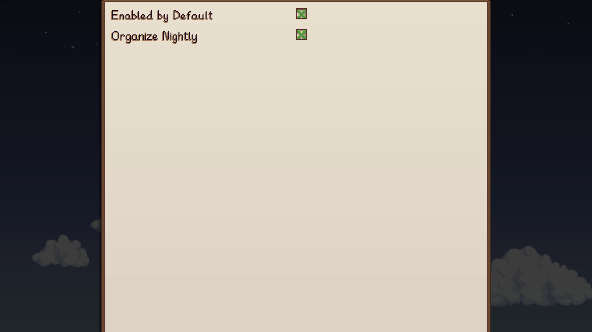
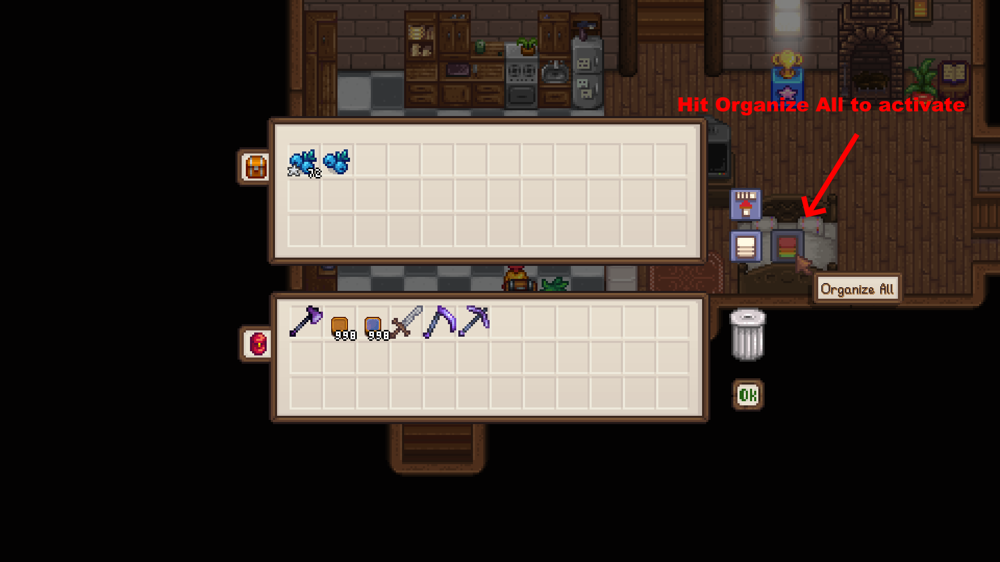
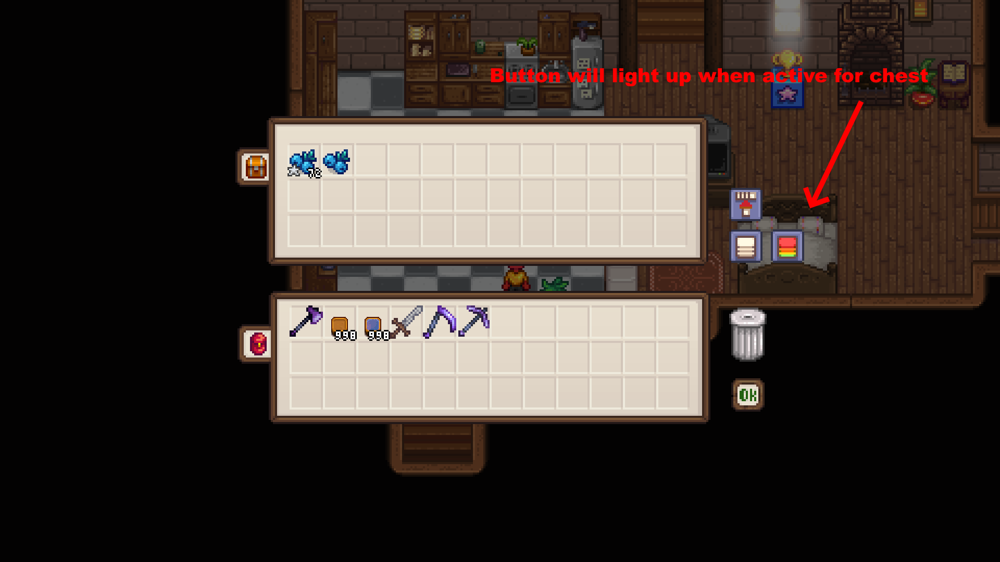
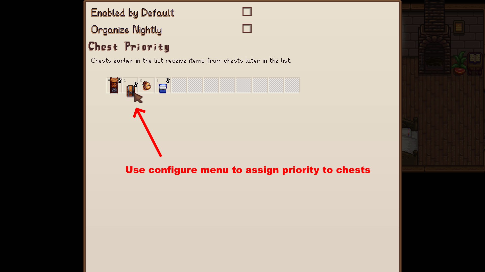
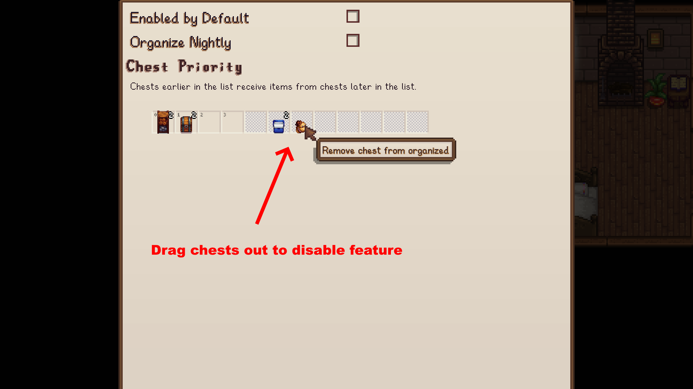
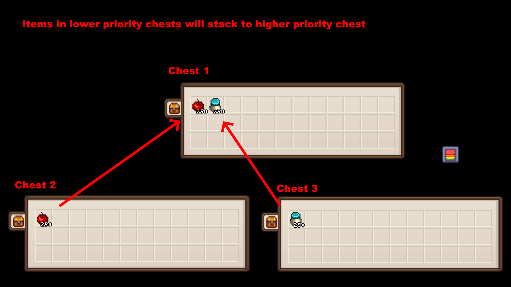

# Ultra Organized Inventory

Stardew Valley mod which allows you to organize items across all chests.

## Table of Contents

- [Ultra Organized Inventory](#ultra-organized-inventory)
  - [Table of Contents](#table-of-contents)
  - [Configurations](#configurations)
  - [Features](#features)
  - [Translations](#translations)

## Configurations

For ease of use, it is recommended to set config options
from [Generic Mod Config Menu](https://www.nexusmods.com/stardewvalley/mods/5098).

## Features

Hit Organize All to activate for chest.

The button lights up to indicate it is active.

Prioritize chests for organization.

Remove chests from organize all.

Items will move to higher priority chests.

## Translations

❌️ = Not Translated, ❔ = Incomplete, ✔️ = Complete

|            |         Unlimited Storage          |
| :--------- | :--------------------------------: |
| Chinese    | [❌️](UnlimitedStorage/i18n/zh.json) |
| French     | [❌️](UnlimitedStorage/i18n/fr.json) |
| German     | [❌️](UnlimitedStorage/i18n/de.json) |
| Hungarian  | [❌️](UnlimitedStorage/i18n/hu.json) |
| Italian    | [❌️](UnlimitedStorage/i18n/it.json) |
| Japanese   | [❌️](UnlimitedStorage/i18n/ja.json) |
| Korean     | [❌️](UnlimitedStorage/i18n/ko.json) |
| Portuguese | [❌️](UnlimitedStorage/i18n/pt.json) |
| Russian    | [❌️](UnlimitedStorage/i18n/ru.json) |
| Spanish    | [❌️](UnlimitedStorage/i18n/es.json) |
| Turkish    | [❌️](UnlimitedStorage/i18n/tr.json) |